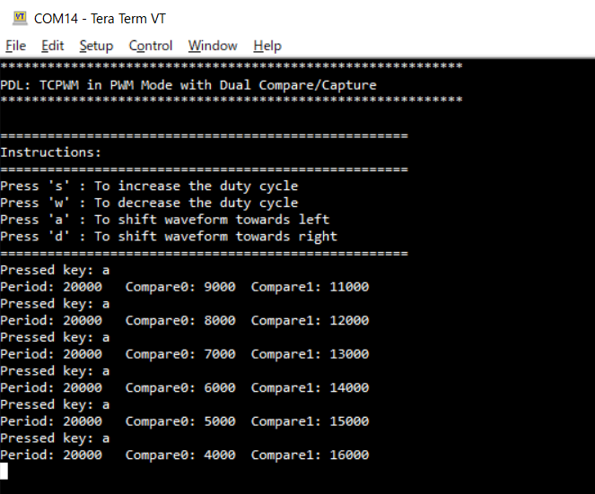
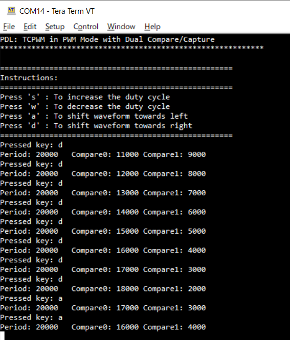

# TCPWM Asymmetric PWM Generation

**This code example demonstrates the generation of asymmetric PWM signals using two compare/capture registers available in the Timer, Counter and PWM (TCPWM) block.**

## Device

The device used in this code example (CE) is:

- [TRAVEO™ T2G CYT4BF Series](https://www.infineon.com/cms/en/product/microcontroller/32-bit-traveo-t2g-arm-cortex-microcontroller/32-bit-traveo-t2g-arm-cortex-for-body/traveo-t2g-cyt4bf-series/)
- [TRAVEO™ T2G CYT2BL Series](https://www.infineon.com/cms/en/product/microcontroller/32-bit-traveo-t2g-arm-cortex-microcontroller/32-bit-traveo-t2g-arm-cortex-for-body/traveo-t2g-cyt2bl-series/)

## Board

The board used for testing is:

- TRAVEO™ T2G evaluation kit ([KIT_T2G-B-H_EVK](https://www.infineon.com/cms/en/product/evaluation-boards/kit_t2g-b-h_evk/), [KIT_T2G-B-H_LITE](https://www.infineon.com/cms/en/product/evaluation-boards/kit_t2g-b-h_lite/), [KIT_T2G-B-E_LITE](https://www.infineon.com/cms/en/product/evaluation-boards/kit_t2g-b-e_lite/))

## Scope of work

Compared to the asymmetric PWM realized with only one compare function (where the CPU is used to update the compare value twice every PWM cycle), this solution uses two independent buffered compare values and causes less load on the CPU (where the CPU is used to update the compare value once every PWM cycle). PWM waveform can be modified through the command on the terminal.

## Introduction  

**TCPWM**  
TRAVEO™ T2G platform supports the following TCPWM features:

- Supports up to four counter groups (device specific)
- Each counter group consists up to 256 counters (counter group specific)
- Each counter can run in one of seven function modes:
    - Timer-counter with compare
    - Timer-counter with capture
    - Quadrature decoding
    - Pulse width modulation/stepper motor control (SMC) for pointer instruments
    - PWM with dead time/three-phase motor control (Brushless-DC, BLDC)
    - Pseudo-random PWM
    - Shift register mode
- 16-bit or 32-bit counters (counter group specific)
- Up, down, and up/down counting modes
- Clock prescaling (division by 1, 2, 4, ... 64, 128)
- Up to two capture and compare functions (counter group specific)
- Double buffering of all compare/capture and period registers
- Two output trigger signals for each counter to indicate underflow, overflow, and capture/compare events; they can also directly be connected with the line output signal
- Supports interrupt on:
    - Terminal Count - Depends on the mode; typically occurs on overflow or underflow
    - Capture/Compare - The count is captured in the capture registers or the counter value equals the value in the compare register
- Line out selection feature for stepper motor application including two complementary output lines with dead time insertion
- Selectable start, reload, stop, count, and two capture event signals for each TCPWM with rising edge, falling edge, both edges, and level trigger options
- Each counter with up to 254 (device specific) synchronized input trigger signals and two constant input signals: '0' and '1'.
- Two types of input triggers for each counter: 
    - General-purpose triggers used by all counters 
    - One-to-one triggers for specific counter
- Synchronous operation of multiple counters
- Debug mode support

## Hardware setup

This CE has been developed for:
- TRAVEO™ T2G evaluation kit ([KIT_T2G-B-H_EVK](https://www.infineon.com/cms/en/product/evaluation-boards/kit_t2g-b-h_evk/)) 
 
- TRAVEO™ T2G Body High Lite evaluation kit ([KIT_T2G-B-H_LITE](https://www.infineon.com/cms/en/product/evaluation-boards/kit_t2g-b-h_lite/)) 
 

- TRAVEO™ T2G Body High Entry evaluation kit ([KIT_T2G-B-E_LITE](https://www.infineon.com/cms/en/product/evaluation-boards/kit_t2g-b-e_lite/)) 
 

  This CE uses following pins to monitor the behavior:
   1. PWM_VARIABLE - PWM output for modifying waveform
   2. PWM_FIXED - PWM output for reference

  The actual pin name can be referred in design.modus file.

## Implementation

This code example demonstrates generating asymmetric PWM signals using dual compare/capture, which have been configured in the Device Configurator.
In this example, two channels of the TCPWM is configured. One is for that the duty cycle and alignment of PWM can be adjusted via terminal software (e.g. Tera Term) connected to KitProg3 port. Another is for show the original wave form as a reference. These TCPWMs are started simultaneously by software via the Trigger Multiplexer.

**STDIN / STDOUT setting**

Calling <a href="https://infineon.github.io/retarget-io/html/group__group__board__libs.html#ga21265301bf6e9239845227c2aead9293"><i>cy_retarget_io_init()</i></a> function to use UART as STDIN / STDOUT

- Initialize P13.1 as UART TX, P13.0 as UART RX (these pins are connected to KitProg3 COM port)
- The serial port parameters become to 8N1 and 115200 baud

The UART receiving interrupt is configured in the <a href="https://infineon.github.io/mtb-hal-cat1/html/group__group__hal__uart.html#ga4dae4cef7dbf1d7935fe6dd6d31f282e"><i>cyhal_uart_enable_event()</i></a> function

- When the command is received through the terminal, interrupt occur and it reflects to PWM waveform by *process_Key_Press()*.

   

- The callback routine is prepared as *handle_UART_Event()* and is registered by the <a href="https://infineon.github.io/mtb-hal-cat1/html/group__group__hal__uart.html#gae26bab64811713b1d69170352fe32c20"><i>cyhal_uart_register_callback()</i></a> function, it will be call backed from the driver by calling <a href="https://infineon.github.io/mtb-hal-cat1/html/group__group__hal__uart.html#ga00ef108f7ee7beba3d5090b2e506b54f"><i>cyhal_uart_read_async()</i></a> if some data is received and available

**Initialize and enable the TCPWM**

Initialization of the TCPWM is done once in the <a href="https://infineon.github.io/mtb-pdl-cat1/pdl_api_reference_manual/html/group__group__tcpwm__functions__pwm.html#ga6440d2a9dc8d85056abd62556bee7f82"><i>Cy_TCPWM_PWM_Init()</i></a> function, then enables the TCPWM in the <a href="https://infineon.github.io/mtb-pdl-cat1/pdl_api_reference_manual/html/group__group__tcpwm__functions__pwm.html#ga802ebf3a49b1056e4bc5b057deb26e49"><i>Cy_TCPWM_PWM_Enable()</i></a> function

- Default: center-aligned square wave with a 50% duty cycle is generated on the specified pin
- The default value is read from TCPWM registers into variables by PDL functions (<a href="https://infineon.github.io/mtb-pdl-cat1/pdl_api_reference_manual/html/group__group__tcpwm__functions__pwm.html#ga83afe813dd570a369065a6d568d50636"><i>Cy_TCPWM_PWM_GetPeriod0()</i></a>, <a href="https://infineon.github.io/mtb-pdl-cat1/pdl_api_reference_manual/html/group__group__tcpwm__functions__pwm.html#ga737ae84fde081c31bc0a74092bb79900"><i>Cy_TCPWM_PWM_GetCompare1Val()</i></a>, <a href="https://infineon.github.io/mtb-pdl-cat1/pdl_api_reference_manual/html/group__group__tcpwm__functions__pwm.html#ga3979ea2dfd285f2ac008ebb8fc5d0cc0"><i>Cy_TCPWM_PWM_GetCompare0Val()</i></a>)

The interrupt handler for the PWM Terminal Count event is prepared as *handle_TCPWM_Interrupt()* and is registered by <a href="https://infineon.github.io/mtb-pdl-cat1/pdl_api_reference_manual/html/group__group__sysint__functions.html#gab2ff6820a898e9af3f780000054eea5d"><i>Cy_SysInt_Init()</i></a>, and the interrupt is enabled by *NVIC_EnableIRQ()*

**Start the PWM**

Starts the TCPWM in the <a href="https://infineon.github.io/mtb-pdl-cat1/pdl_api_reference_manual/html/group__group__tcpwm__functions__common.html#gaafe86ec440bec9a2c23392f289cc3a8b"><i>Cy_TCPWM_TriggerStart_Single()</i></a> function

**Changing duty / alignment of the PWM**

In *process_key_press()* function, duty and alignment is changed by PDL functions(<a href="https://infineon.github.io/mtb-pdl-cat1/pdl_api_reference_manual/html/group__group__tcpwm__functions__pwm.html#ga9c63c17045b417ecfa6e0346f9f99879"><i>Cy_TCPWM_PWM_SetCompare0BufVal()</i></a>, <a href="https://infineon.github.io/mtb-pdl-cat1/pdl_api_reference_manual/html/group__group__tcpwm__functions__pwm.html#ga917ec6c83509f3de84b7741fcc140c9b"><i>Cy_TCPWM_PWM_SetCompare1BufVal()</i></a>, <a href="https://infineon.github.io/mtb-pdl-cat1/pdl_api_reference_manual/html/group__group__tcpwm__functions__common.html#gadba9d406c3bd2b008aa7bbadcd5f32c2"><i>Cy_TCPWM_TriggerCaptureOrSwap_Single()</i></a>)

**Using device configurator**

The configuration required for the TCPWM block is done in a custom design.modus file. This can be opened by Device Configurator, also can be modified. If saved, all settings will be reflected to codes.

## Run and Test
For this example, a terminal emulator is required for displaying outputs. Install a terminal emulator if you do not have one. Instructions in this document use [Tera Term](https://ttssh2.osdn.jp/index.html.en).

After code compilation, perform the following steps to flashing the device:

1. Connect the board to your PC using the provided USB cable through the KitProg3 USB connector.
2. Open a terminal program and select the KitProg3 COM port. Set the serial port parameters to 8N1 and 115200 baud.
3. Program the board using one of the following:
    - Select the code example project in the Project Explorer.
    - In the **Quick Panel**, scroll down, and click **[Project Name] Program (KitProg3_MiniProg4)**.
4. After programming, the code example starts automatically. Confirm that the messages are displayed on the UART terminal.

    - *Terminal and pin output on program startup*   
    - *Increase the duty cycle*   
    - *Decrease the duty cycle*   
    - *Shift the waveform left*   
    - *Shift the waveform right*   

5. You can debug the example to step through the code. In the IDE, use the **[Project Name] Debug (KitProg3_MiniProg4)** configuration in the **Quick Panel**. For details, see the "Program and debug" section in the [Eclipse IDE for ModusToolbox™ software user guide](https://www.infineon.com/dgdl/?fileId=8ac78c8c8386267f0183a8d7043b58ee).

**Note:** **(Only while debugging)** On the CM7 CPU, some code in *main()* may execute before the debugger halts at the beginning of *main()*. This means that some code executes twice: once before the debugger stops execution, and again after the debugger resets the program counter to the beginning of *main()*. See [KBA231071](https://community.infineon.com/t5/Knowledge-Base-Articles/PSoC-6-MCU-Code-in-main-executes-before-the-debugger-halts-at-the-first-line-of/ta-p/253856) to learn about this and for the workaround.

## References  
Datasheets are:
- [CYT4BF series](https://www.infineon.com/dgdl/?fileId=5546d46275b79adb0175dc8387f93228)
- [CYT2BL series](https://www.infineon.com/dgdl/?fileId=8ac78c8c82ce566401836c4d5e9a46c8)

Technical Reference Manuals (TRM) are:
- [T2G body high family Technical Reference Manual](https://www.infineon.com/dgdl/?fileId=5546d4627600a6bc017600bfae720007)
- [CYT4BF Registers TRM](https://www.infineon.com/dgdl/?fileId=5546d4627600a6bc017600be2aef0004)
- [T2G body entry family Technical Reference Manual](https://www.infineon.com/dgdl/?fileId=5546d462766cbe860176804ea8d27e9b)

Relevant Application notes are:
- AN235305 - GETTING STARTED WITH TRAVEO™ T2G FAMILY MCUS IN MODUSTOOLBOX™
- [AN224434](https://www.infineon.com/dgdl/?fileId=8ac78c8c7cdc391c017d0d3a71ec674a) - Clock configuration setup in TRAVEO™ T2G family CYT4B series
- [AN220208](https://www.infineon.com/dgdl/?fileId=8ac78c8c7cdc391c017d0d3a61a96742) - Clock configuration setup in TRAVEO™ T2G body entry family
- [AN219842](https://www.infineon.com/dgdl/?fileId=8ac78c8c7cdc391c017d0d3a490a6732) - How to use interrupt in TRAVEO™ II
- [AN220224](https://www.infineon.com/dgdl/?fileId=8ac78c8c7cdc391c017d0d3a800a6752) - How to Use Timer, Counter, and PWM (TCPWM) in Traveo II Family

ModusToolbox™ is available online:
- <https://www.infineon.com/modustoolbox>

Associated TRAVEO™ T2G MCUs can be found on:
- <https://www.infineon.com/cms/en/product/microcontroller/32-bit-traveo-t2g-arm-cortex-microcontroller/>

More code examples can be found on the GIT repository:
- [TRAVEO™ T2G Code examples](https://github.com/orgs/Infineon/repositories?q=mtb-t2g-&type=all&language=&sort=)

For additional trainings, visit our webpage:  
- [TRAVEO™ T2G trainings](https://www.infineon.com/cms/en/product/microcontroller/32-bit-traveo-t2g-arm-cortex-microcontroller/32-bit-traveo-t2g-arm-cortex-for-body/traveo-t2g-cyt4bf-series/#!trainings)

For questions and support, use the TRAVEO™ T2G Forum:  
- <https://community.infineon.com/t5/TRAVEO-T2G/bd-p/TraveoII>  
